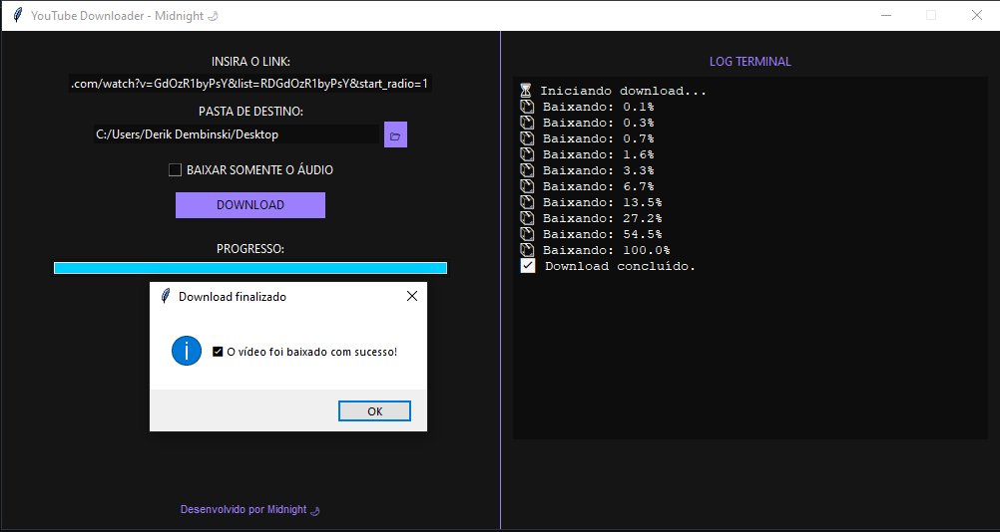

# 🎥 YouTube Downloader - Midnight 🌙

Uma aplicação para baixar vídeos e áudios do YouTube com **interface escura moderna**, construída com **Python + Tkinter + yt-dlp**.



---

## ✨ Funcionalidades

- 🔽 Baixa vídeos do YouTube em **qualidade máxima**
- 🎧 Suporte para baixar apenas o **áudio em MP3**
- 📂 Escolha a **pasta de destino**
- 🖥️ Interface escura com visual inspirado em **Midnight**
- 🔄 Barra de progresso com feedback em tempo real
- ✅ Notificação ao final do download

---

## 📦 Download

Baixe a versão mais recente clicando abaixo:

👉 [🔗 Ir para Releases](https://github.com/DerikDembinski0/Youtube-downloader/releases)

---

## 🚀 Executar o projeto localmente

### Pré-requisitos

- Python 3.8+
- yt-dlp
- Pillow (para o ícone)

### Instalação

```bash
git clone https://github.com/DerikDembinski0/Youtube-downloader.git
cd Youtube-downloader
pip install -r requirements.txt
python interface.py
